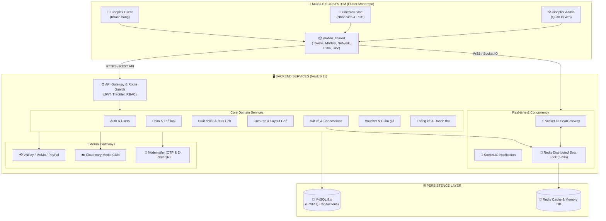

<div align="center">

# 🎬 CINEPLEX
### Hệ Thống Quản Lý Rạp Chiếu Phim & Đặt Vé Trực Tuyến Đa Nền Tảng
**A Next-Generation, High-Performance Multi-App Cinema Management & Real-time Booking Platform**

[](https://flutter.dev)
[](https://dart.dev)
[](https://nestjs.com)
[](https://www.typescriptlang.org)
[](https://www.mysql.com)
[](https://redis.io)
[](https://socket.io)

---

[📖 Giới Thiệu](#-1-tổng-quan-đề-tài) •
[🏗️ Kiến Trúc Hệ Thống](#-2-kiến-trúc-hệ-thống) •
[📱 Hệ Sinh Thái Ứng Dụng](#-3-hệ-sinh-thái-ứng-dụng-mobile) •
[⚡ Backend & API](#-4-hạ-tầng-backend--dịch-vụ) •
[🎨 Design System](#-5-thiết-kế-giao-diện--uiux-design-system) •
[🚀 Hướng Dẫn Cài Đặt](#-6-hướng-dẫn-cài-đặt--chạy-dự-án) •
[🛡️ Đóng Góp & Quy Chuẩn](#-7-quy-chuẩn-phát-triển)

---

</div>

## 📌 1. Tổng Quan Đề Tài

**CINEPLEX** là giải pháp phần mềm toàn diện giải quyết bài toán vận hành chuỗi rạp chiếu phim hiện đại theo mô hình đa nền tảng (**Multi-App Monorepo Ecosystem**). Hệ thống kết nối liền mạch giữa:

1. **Khách hàng (Client App):** Trải nghiệm xem lịch chiếu, chọn rạp, chọn ghế với hiệu ứng điện ảnh cao cấp, khóa ghế thời gian thực tránh trùng lặp, mua bắp nước và thanh toán trực tuyến an toàn.
2. **Nhân viên rạp (Staff App):** Điểm bán vé tại quầy (POS), quét camera mã QR vé điện tử với tốc độ tức thì để kiểm soát ra/vào phòng chiếu, theo dõi tỉ lệ lấp đầy phòng chiếu và lịch trực cá nhân.
3. **Ban Quản trị (Admin App):** Trung tâm điều hành thông minh: Thống kê doanh thu, quản lý phim, lập lịch chiếu hàng loạt (Bulk create), cấu hình ma trận phòng chiếu, chương trình khuyến mãi (Voucher) và phân quyền nhân sự.

### 🌟 Điểm Sáng Công Nghệ Cốt Lõi
- ⏱️ **Real-time Distributed Seat Lock (Redis + Socket.IO):** Khóa giữ ghế tạm thời trong **5 phút** ngay khi khách hàng chọn ghế, ngăn chặn tình trạng xung đột đặt trùng ghế (race condition) giữa nhiều người dùng cùng thời điểm.
- 🏢 **Monorepo Architecture:** 3 ứng dụng Flutter dùng chung package hạt nhân `mobile_shared`, tái sử dụng 100% Core Design Tokens, Dio Networking, Models, Repositories và Quản lý Đa ngôn ngữ.
- 💳 **Đa Cổng Thanh Toán:** Tích hợp VNPay, MoMo, PayPal qua cơ chế WebView và IPN Webhook đồng bộ kết quả tức thì.
- 🎫 **Vé Điện Tử Động (Dynamic QR Ticket):** Mã hóa thông tin vé thành QR Code động, hỗ trợ quét kiểm tra hợp lệ tại rạp và gửi vé PDF kèm mã QR qua Email tự động.
- 🌙 **Premium Cinema Design System:** Hỗ trợ toàn diện **Cinema Dark Theme** (tối ưu màn hình AMOLED/OLED) và Light Mode với độ tương phản đạt chuẩn WCAG AA.

---

## 🏗️ 2. Kiến Trúc Hệ Thống

Toàn bộ hệ thống được thiết kế theo kiến trúc phân tầng rõ ràng (Layered Architecture), module hóa độc lập, đảm bảo khả năng mở rộng (Scalability), độ tin cậy và hiệu năng cao.



---

## 📱 3. Hệ Sinh Thái Ứng Dụng Mobile

Mã nguồn Mobile được tổ chức trong thư mục `mobile/` theo cấu trúc Monorepo phân tách chức năng:

```text
mobile/
├── mobile_shared/            # Package chia sẻ dùng chung (Core Foundation)
│   ├── lib/
│   │   ├── network/          # DioClient, Interceptors (Auto JWT & Refresh Token)
│   │   ├── services/         # SocketService, StorageService
│   │   ├── theme/            # CineplexColors, AppTheme, Dark/Light Mode Tokens
│   │   ├── widgets/          # AppButton, AppTextField, ShimmerSkeleton, AppCard...
│   │   ├── models/           # MovieModel, ShowtimeModel, SeatModel, BookingModel...
│   │   ├── repositories/     # Shared Repositories
│   │   └── l10n/             # app_vi.arb (Quản lý 100% Tiếng Việt tập trung)
│
├── cineplex_client/          # ỨNG DỤNG KHÁCH HÀNG (Customer App)
│   ├── lib/features/
│   │   ├── auth/             # Đăng nhập, Đăng ký, Quên mật khẩu OTP
│   │   ├── home/             # Hero Carousel 310px, Phim đang chiếu, Sắp chiếu
│   │   ├── movie/            # Chi tiết phim, Trailer Player, Thông tin diễn viên
│   │   ├── showtime/         # Date selector capsule, Cụm rạp, Tag 2D/3D/IMAX
│   │   ├── booking/          # Sơ đồ ghế điện ảnh cong, Giữ ghế Real-time 5 phút
│   │   ├── concession/       # Chọn Combo bắp rang, nước ngọt
│   │   ├── payment/          # Thanh toán VNPay / MoMo / PayPal WebView
│   │   ├── ticket/           # Quản lý vé điện tử & Mã QR Check-in
│   │   └── profile/          # Thông tin cá nhân, Đổi mật khẩu, Cài đặt theme
│
├── cineplex_staff/           # ỨNG DỤNG NHÂN VIÊN (Staff App)
│   ├── lib/features/
│   │   ├── scanner/          # Quét camera QR mã vé, xác thực hợp lệ theo suất
│   │   ├── ticket_sale/      # Điểm bán vé tại quầy (POS) cho khách trực tiếp
│   │   ├── showtimes/        # Theo dõi tỷ lệ lấp đầy phòng chiếu theo thời gian thực
│   │   ├── schedule/         # Xem lịch phân công ca làm việc theo tuần
│   │   └── profile/          # Thông tin cá nhân nhân viên
│
└── cineplex_admin/           # ỨNG DỤNG QUẢN TRỊ VIÊN (Admin App)
    ├── lib/features/
    │   ├── statistics/       # Dashboard biểu đồ doanh thu, vé bán, top phim
    │   ├── movie/            # Thêm/sửa/xóa phim, upload poster Cloudinary
    │   ├── showtime/         # Lập lịch chiếu lẻ & Bulk Create tránh xung đột
    │   ├── cinema/           # Quản lý rạp, cấu hình phòng chiếu & ma trận ghế
    │   ├── promotion/        # Quản lý mã giảm giá voucher theo % hoặc số tiền
    │   ├── concession/       # Quản lý menu combo bắp nước & giá bán
    │   ├── users/            # Quản lý tài khoản, phân quyền User/Staff/Admin
    │   └── shift/            # Phân ca trực và lịch làm việc cho nhân viên rạp
```

---

## ⚡ 4. Hạ Tầng Backend & Dịch Vụ

Được xây dựng với **NestJS 11**, Backend áp dụng Clean Architecture, tự động hóa xử lý ngoại lệ và bảo mật đa tầng:

| Phân hệ (Module) | Công nghệ / Thư viện | Trách nhiệm chính |
|---|---|---|
| **Auth & Security** | `@nestjs/passport`, `jwt`, `bcrypt` | Xác thực đăng nhập, refresh token, phân quyền RBAC (`USER`, `STAFF`, `ADMIN`). |
| **Realtime Booking** | `@nestjs/websockets`, `socket.io`, `ioredis` | Socket.IO Gateway đồng bộ ghế realtime; Redis phân tán khóa ghế 5 phút. |
| **Data Persistence** | `TypeORM`, `MySQL 8` | Quản lý quan hệ dữ liệu: Phim, Rạp, Phòng chiếu, Suất chiếu, Đơn hàng, Vé. |
| **Payment Gateways** | VNPay SDK, MoMo API, PayPal Sandbox | Khởi tạo giao dịch thanh toán qua URL WebView, xử lý IPN Webhook xác nhận giao dịch. |
| **Media Management** | `cloudinary`, `multer`, `streamifier` | Tải lên và tối ưu hóa hình ảnh poster, banner phim, hình combo bắp nước. |
| **Email & Ticket QR** | `@nestjs-modules/mailer`, `qrcode` | Sinh mã QR vé điện tử, gửi OTP xác thực tài khoản và email vé điện tử. |
| **Automation Crons** | `@nestjs/schedule` | Tự động quét dọn ghế giữ quá hạn 5 phút, cập nhật trạng thái suất chiếu đã kết thúc. |

---

## 🎨 5. Thiết Kế Giao Diện & UI/UX Design System

Dự án áp dụng ngôn ngữ thiết kế **Premium Cinema Experience** — Đậm chất điện ảnh, chiều sâu thị giác nổi bật và tối ưu thao tác ngón tay trên thiết bị di động:

```
+-----------------------------------------------------------------------------------+
|                            CINEPLEX DESIGN SYSTEM                                 |
+-----------------------------------------------------------------------------------+
|  [Background]      #121212 (Deep Cinema Dark)     | Card Surface: #1E1E24         |
|  [Brand Red]       #E50914 (Red Velvet)          | Amber Gold:   #E58E26         |
|  [Tech Accent]     #3A86FF (IMAX Electric Blue)  | Success:      #22C55E         |
|                                                                                   |
|  [Sơ đồ ghế]:                                                                    |
|  - Ghế thường (Standard):  #718096 (Xám lạnh)     - Đang chọn:     #22C55E (Xanh) |
|  - Ghế VIP:                #E50914 (Đỏ nhung)     - Khóa 5p:       #F59E0B (Cam)  |
|  - Ghế đôi (Sweetbox):     #D946EF (Hồng tím)     - Đã bán:        #374151 (Mờ)   |
+-----------------------------------------------------------------------------------+
```

### 💎 Điểm Nhấn Giao Diện Nổi Bật:
1. **Hero Movie Carousel (310px):**
   - Tỷ lệ chuẩn điện ảnh với `viewportFraction: 0.88`, hé lộ poster kế bên tạo cảm giác cuộn mượt mà.
   - Hiệu ứng đổ bóng 4 tầng (4-stop gradient scrim) giúp văn bản sắc nét trên mọi poster sáng/tối.
   - Nút CTA Gradient "Đặt vé ngay" cùng vạch chỉ báo trang mở rộng dạng capsule 22px.
2. **Cinematic Movie Detail (350px Hero):**
   - Banner chuyển tiếp đa tầng mượt mà, nút quay lại tròn đen mờ viền hairline chống chìm.
   - Nút xem Trailer dạng viên thuốc Frosted Glass hiện đại đặt tại tâm điểm.
   - Thẻ thông tin phim có icon container bo tròn chuyên nghiệp, chống tràn chữ.
3. **Date Selector Capsule & Suất Chiếu:**
   - Bộ chọn ngày dạng viên thuốc hiện đại (84x58px) kèm nhận diện tự động ngày "Hôm nay".
   - Thẻ rạp bo góc 16px, badge số lượng suất chiếu và phân định rõ định dạng phòng (2D / 3D / IMAX).
4. **Màn Hình Chiếu Cong (Cinema Projector Arc):**
   - Vệt sáng máy chiếu sắc nét với đường cong nón ánh sáng và nhãn "MÀN HÌNH" dãn dòng điện ảnh.
   - Thanh Order Sheet bo cong 22px ở đáy màn hình, hiển thị chip ghế đã chọn cho phép nhả ghế trực tiếp.
5. **Floating Liquid Glass Navigation Bar:**
   - Thanh điều hướng nổi bo tròn 32px với hiệu ứng mờ kính (Blur 20px) và capsule đỏ chuyển động theo tab.
6. **Chuẩn Localization (L10n):**
   - 100% giao diện sử dụng Tiếng Việt chuẩn hóa trong `app_vi.arb`, tiền tố camelCase theo từng module (`auth*`, `movie*`, `ticket*`, `showtime*`, `pos*`, `admin*`).

---

## 🚀 6. Hướng Dẫn Cài Đặt & Chạy Dự Án

### Yêu Cầu Môi Trường (Prerequisites)
- **Node.js:** v18.x trở lên & `npm` v9+
- **Flutter SDK:** v3.19+ & **Dart SDK:** v3.3+
- **Cơ sở dữ liệu:** MySQL 8.x
- **In-Memory Cache:** Redis Server 6.x trở lên
- **Thiết bị chạy:** Android Emulator / Android Device / iOS Simulator

---

### Bước 1: Khởi Tạo & Chạy Backend

1. Di chuyển vào thư mục backend và cài đặt thư viện:
   ```bash
   cd backend
   npm install
   ```

2. Tạo file cấu hình môi trường `.env` từ file mẫu:
   ```bash
   cp .env.example .env
   ```
   *Cấu hình các thông số kết nối MySQL, Redis, JWT Secret, Cloudinary và Email SMTP.*

3. Khởi chạy Backend ở chế độ phát triển:
   ```bash
   npm run start:dev
   ```
   *Server sẽ lắng nghe tại `http://localhost:3000` (Swagger tài liệu API tại `/api/docs`).*

---

### Bước 2: Khởi Tạo & Chạy Mobile Apps

1. Cập nhật IP LAN/Wi-Fi tự động cho toàn bộ 3 ứng dụng Flutter:
   ```bash
   npm run client:dev    # Hoặc node scripts/update-ip.js
   ```

2. Cài đặt dependencies cho toàn bộ monorepo:
   ```bash
   # Cài đặt cho shared package
   cd mobile/mobile_shared && flutter pub get

   # Cài đặt cho từng app
   cd ../cineplex_client && flutter pub get
   cd ../cineplex_staff && flutter pub get
   cd ../cineplex_admin && flutter pub get
   ```

3. Khởi chạy từng ứng dụng mong muốn:

   - **Chạy ứng dụng Khách hàng (Client):**
     ```bash
     npm run client:dev
     # hoặc
     cd mobile/cineplex_client && flutter run --dart-define-from-file=.env
     ```

   - **Chạy ứng dụng Nhân viên (Staff):**
     ```bash
     npm run staff:dev
     # hoặc
     cd mobile/cineplex_staff && flutter run --dart-define-from-file=.env
     ```

   - **Chạy ứng dụng Quản trị viên (Admin):**
     ```bash
     npm run admin:dev
     # hoặc
     cd mobile/cineplex_admin && flutter run --dart-define-from-file=.env
     ```

---

## 🛡️ 7. Quy Chuẩn Phát Triển

Dự án áp dụng quy chuẩn kỹ thuật nghiêm ngặt nhằm đảm bảo chất lượng mã nguồn:

### 1. Quy Tắc Kiểm Thử & Phân Tích Tĩnh
- **Kiểm tra cú pháp & Code Quality:**
  ```bash
  flutter analyze
  ```
- **Kiểm thử tự động UI & Logic:**
  ```bash
  flutter test
  ```
  *(Toàn bộ test suite bao gồm Viewport Stress Tests 320px - 390px, Kiểm tra độ tương phản WCAG AA, BLoC State Tests đều phải đạt 100% Passed).*

### 2. Quy Tắc Phân Nhánh & Git Workflow
- `main`: Nhánh ổn định, sẵn sàng triển khai (Production branch).
- `dev`: Nhánh tích hợp chính của các tính năng mới (Development branch).
- `feat/<feature-name>`: Nhánh phát triển tính năng mới.
- `fix/<bug-name>`: Nhánh sửa lỗi.
- `docs/<doc-name>`: Nhánh cập nhật tài liệu dự án.
- **Commit Convention:** Tuân thủ Conventional Commits (`feat:`, `fix:`, `docs:`, `refactor:`, `test:`, `chore:`).

---

<div align="center">

**CINEPLEX — Nâng tầm trải nghiệm điện ảnh số.**  
*Được phát triển với niềm đam mê công nghệ và sự tỉ mỉ trong từng chi tiết giao diện.*

</div>
