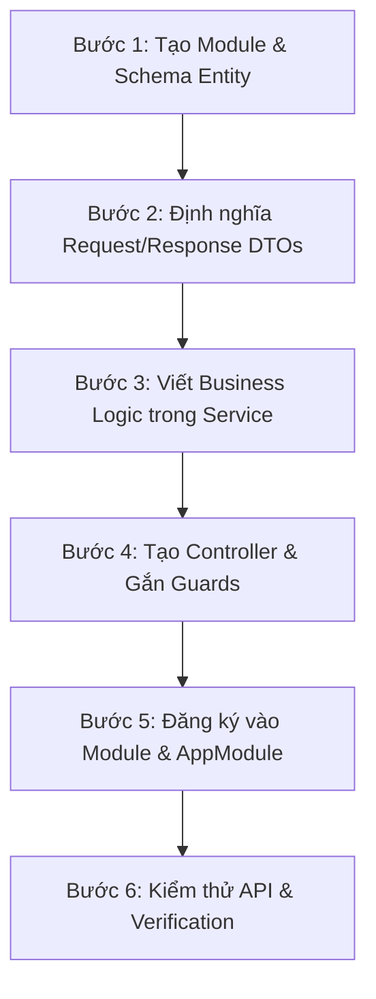

# Backend Development Workflow & Lifecycle (`CINEPLEX Backend`)

Tài liệu này hướng dẫn quy trình tiêu chuẩn từng bước để xây dựng một tính năng mới hoặc xử lý bug trong hệ thống Backend CINEPLEX.

---

## 1. Quy trình phát triển một Feature mới

Khi tạo mới một tính năng hoặc nghiệp vụ trong Backend CINEPLEX, hãy tuân theo 6 bước chuẩn hóa sau:

---

### Bước 1: Tạo Entity & Khai báo Schema TypeORM
1. Tạo thư mục module: `backend/src/module/<feature_name>/entities/`.
2. Tạo file `<feature_name>.entity.ts` với đầy đủ `@Entity()`, `@PrimaryGeneratedColumn()`, `@Column()`, quan hệ `@ManyToOne` / `@OneToMany` và `@CreateDateColumn()`.
3. Khai báo Entity vào `TypeOrmModule.forFeature([FeatureEntity])`.

---

### Bước 2: Định nghĩa DTOs (Data Transfer Objects)
1. Tạo thư mục `backend/src/module/<feature_name>/dto/`.
2. Khai báo các DTO đầu vào: `create-<feature>.dto.ts`, `update-<feature>.dto.ts`, `query-<feature>.dto.ts`.
3. Gắn đầy đủ decorator validation từ `class-validator` (`@IsNotEmpty`, `@IsString`, `@IsNumber`, `@IsEnum`, `@IsOptional`) và `class-transformer` (`@Type`).

---

### Bước 3: Triển khai Business Logic trong Service
1. Tạo file `<feature_name>.service.ts` với decorator `@Injectable()`.
2. Inject Repository thông qua `@InjectRepository(EntityName)`.
3. Viết các method nghiệp vụ:
   - Validate điều kiện nghiệp vụ (kiểm tra rạp/phòng trống, ghế đã đặt, trùng lịch chiếu).
   - Ném lỗi bằng `CustomException` hoặc built-in exception nếu vi phạm.
   - Thao tác database với transaction (`QueryRunner`) khi liên quan đến nhiều bảng (Booking, Vé, Ghế, Thanh toán).
   - Gọi Redis để kiểm tra/giữ ghế tạm nếu thuộc luồng booking.

---

### Bước 4: Tạo Controller & Gắn Guards
1. Tạo file `<feature_name>.controller.ts` với `@Controller('<feature_name>')`.
2. Định nghĩa các endpoints: `@Get()`, `@Post()`, `@Put()`, `@Delete()`.
3. Gắn Guards tương ứng: `@UseGuards(JwtAuthGuard)` hoặc `@UseGuards(JwtAuthGuard, RolesGuard) @Roles(EUserRole.ADMIN, EUserRole.STAFF)`.
4. Nhận params qua `@Body()`, `@Param()`, `@Query()`, `@Req()`.
5. Đặt HTTP Status code tương ứng (`HttpStatus.OK`, `HttpStatus.CREATED`).

---

### Bước 5: Đăng ký Module & Tích hợp AppModule
1. Tạo file `<feature_name>.module.ts`:
   - Import `TypeOrmModule.forFeature([FeatureEntity])`.
   - Khai báo `controllers: [FeatureController]`.
   - Khai báo `providers: [FeatureService]`.
   - Export `FeatureService` nếu module khác cần sử dụng.
2. Import `FeatureModule` vào `backend/src/app.module.ts`.

---

### Bước 6: Kiểm thử & Xác minh (Testing)
1. Khởi chạy server: `npm run backend:dev` (hoặc `npm run dev` từ root).
2. Kiểm tra API bằng Postman/cURL hoặc tích hợp với Frontend/Mobile App.
3. Kiểm tra các luồng:
   - Happy Path (200 / 201)
   - Validation Error (400 Bad Request)
   - Unauthorized / Forbidden (401 / 403)
   - Not Found (404)
   - Concurrency (giữ ghế đồng thời)

---

## 2. Quy trình Fix Bug & Debugging

Khi điều tra và sửa lỗi Backend, Agent/Dev thực hiện truy vết theo thứ tự:

1. **Trace Controller & DTO:** Kiểm tra xem request gửi lên có bị `ValidationPipe` chặn không, decorator nhận đúng body/query/params chưa.
2. **Trace Guard & Auth:** Kiểm tra token có hợp lệ không, vai trò (`ADMIN`, `STAFF`, `USER`) có đủ quyền truy cập endpoint không.
3. **Trace Service:** Kiểm tra logic nghiệp vụ, điều kiện rẽ nhánh `if/else`, giá trị trả về hoặc exception bị throw.
4. **Trace Database Query & SQL:** Kiểm tra câu lệnh TypeORM sinh ra, quan hệ `relations` đã nạp đủ chưa, xử lý transaction `commit`/`rollback` đúng chưa.
5. **Trace Redis & Real-time Socket:** Kiểm tra kết nối Redis, key giữ ghế (`seat_hold:*`), TTL và sự kiện socket gửi đi từ `SeatGateway`.
