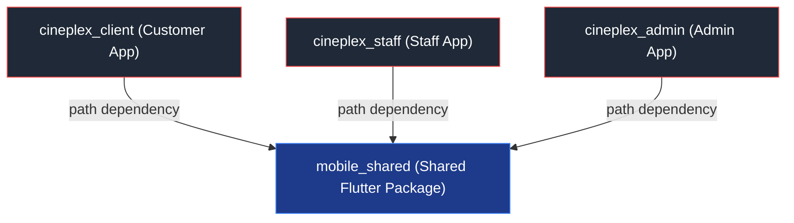

# Flutter Architecture Overview (`CINEPLEX Mobile Monorepo`)

Hệ thống Mobile của CINEPLEX được tổ chức theo mô hình **Multi-App Monorepo** với 4 thư mục con chuyên biệt nhằm tối ưu hóa việc tái sử dụng mã nguồn và chia tách ranh giới nghiệp vụ:

```text
mobile/
├── mobile_shared/         # Package dùng chung (Shared Package)
├── cineplex_client/       # App Khách Hàng (Customer Booking & Loyalty)
├── cineplex_staff/        # App Nhân Viên (Ticket Scanner & POS)
└── cineplex_admin/        # App Quản Trị (Dashboard Analytics & ERP)
```

---

## 1. Ranh giới Phụ thuộc (Dependency Boundaries)



### Quy tắc bất di bất dịch:
1. **Một chiều (Unidirectional):** Các ứng dụng chỉ import từ `package:mobile_shared/mobile_shared.dart`.
2. **Không phụ thuộc chéo (No Cross-App Dependency):** Không bao giờ import `cineplex_client` vào `cineplex_staff` hay `cineplex_admin`.
3. **Thăng cấp tài nguyên (Resource Promotion):** Khi một logic, widget hay model xuất hiện ở 2 ứng dụng trở lên, phải di chuyển nó về `mobile_shared`.

---

## 2. Kiến trúc nội bộ của `mobile_shared`

`mobile_shared` đóng vai trò là thư viện hạ tầng và miền dùng chung:
- **`network/`**: `DioClient` quản lý kết nối HTTP, cấu hình base URL động qua file `.env`, tự động đính kèm JWT Bearer token và xử lý 401.
- **`services/`**: `StorageService` (lưu token an toàn với `flutter_secure_storage`), `SocketService` (quản lý kết nối socket.io realtime).
- **`theme/`**: Hệ thống màu `AppColors`, `CineplexColors` và `AppTheme` chuẩn hoá Light/Dark mode.
- **`widgets/`**: Các Atomic & Molecule widgets: `AppButton`, `AppTextField`, `AppLoading`, `AppErrorView`, `AppCard`, `AppScaffold`.
- **`models/`**: Toàn bộ data models chuẩn trao đổi giữa Client - Server: `UserModel`, `MovieModel`, `CinemaModel`, `SeatModel`, `ShowtimeModel`, `BookingModel`, `TicketModel`, `ConcessionModel`, `StatisticsModel`, `HomeDataModel`.
- **`repositories/`**: `AuthRepository` (xác thực chung cho cả 3 role).
- **`bloc/`**: `AuthBloc` (xử lý đăng nhập, kiểm tra phiên, đăng xuất).
- **`l10n/`**: Thư viện localization tập trung `AppLocalizations` chứa toàn bộ từ điển tiếng Anh và tiếng Việt.

---

## 3. Kiến trúc nội bộ của từng App (`Feature-First Clean Architecture`)

Mỗi ứng dụng độc lập (`cineplex_client`, `cineplex_staff`, `cineplex_admin`) tuân thủ cấu trúc Feature-First:

```text
lib/
├── features/
│   ├── <feature_name>/
│   │   ├── data/
│   │   │   ├── models/        # DTO hoặc Models đặc thù riêng cho app (nếu có)
│   │   │   └── repositories/  # Repository triển khai gọi API bằng DioClient từ mobile_shared
│   │   └── presentation/
│   │       ├── cubit/         # Cubit hoặc BLoC xử lý state màn hình
│   │       ├── screens/       # Màn hình giao diện
│   │       └── widgets/       # Component UI riêng của feature
├── router/                    # Cấu hình GoRouter độc lập cho từng vai trò
├── app.dart                   # Root Widget, MultiBlocProvider, MaterialApp.router
└── main.dart                  # Khởi tạo Services, Repositories và khởi chạy app
```

---

## 4. Chi tiết các tài liệu liên quan:
- [Data Flow](data_flow.md)
- [DTO & Models](dto_and_models.md)
- [Realtime Socket Rules](realtime_socket_rules.md)
- [Services & Repositories](services_and_repositories.md)
- [State Management](state_management.md)
- [UI Standards](ui.md)
