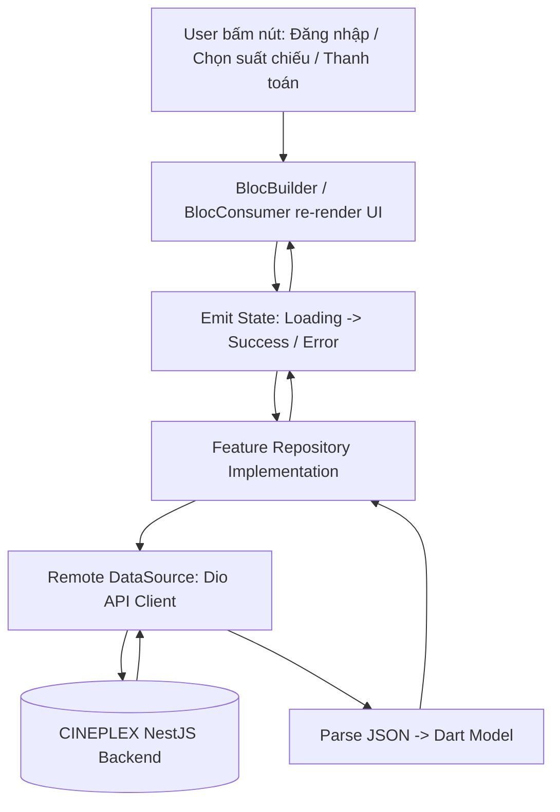
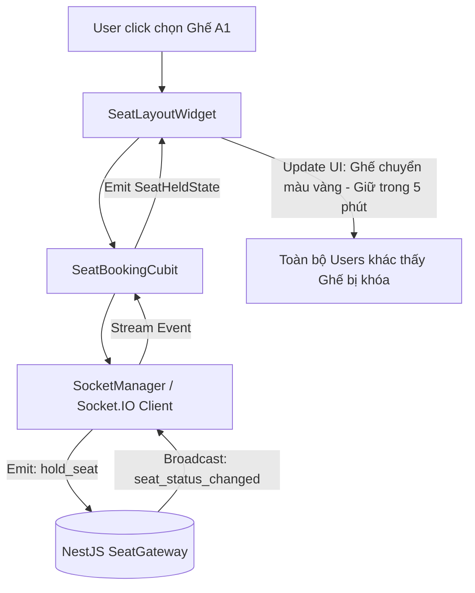

# Luồng Dữ Liệu Ứng Dụng (`Mobile Data Flow`)

Tài liệu này mô tả chi tiết luồng tương tác và truyền tải dữ liệu giữa các thành phần trong ứng dụng Flutter CINEPLEX.

---

## 1. Luồng HTTP Request & State Update

---

## 2. Luồng Real-time WebSocket (Giữ ghế sơ đồ phòng chiếu)

---

## 3. Quy tắc bắt buộc về luồng
1. **Một chiều (Unidirectional Data Flow):** Dữ liệu chỉ chảy từ State -> UI, sự kiện chỉ chảy từ UI -> BLoC -> Repository.
2. **Không mutate State:** Mọi State của BLoC/Cubit phải là immutable (`copyWith` hoặc `freezed`).
3. **Quản lý Stream Socket:** Bắt buộc `cancel` subscription hoặc `leaveRoom` khi `dispose` màn hình sơ đồ ghế để tránh memory leak.
