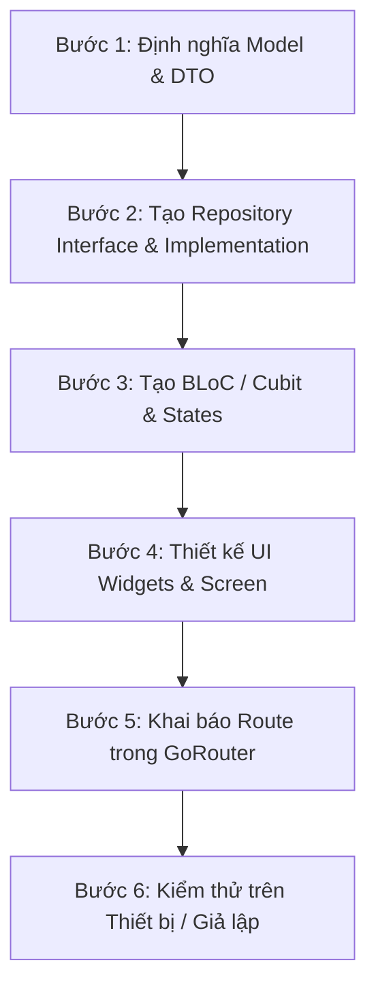

# Feature Development Guide (`Flutter Mobile`)

Tài liệu này hướng dẫn quy trình tiêu chuẩn để thêm một tính năng hoặc màn hình mới trong ứng dụng Flutter CINEPLEX.

---

## Các bước triển khai một Feature mới

---

### Bước 1: Định nghĩa Model & DTO
Tạo file trong `lib/features/<feature>/data/models/` với hàm parse `fromJson` và `toJson`.

### Bước 2: Tạo Repository Interface & Implementation
- Viết abstract class trong `domain/repositories/`.
- Triển khai logic gọi API qua Dio trong `data/repositories/`.

### Bước 3: Tạo BLoC / Cubit & States
- Tạo `presentation/bloc/` hoặc `presentation/cubit/`.
- Định nghĩa các trạng thái Initial, Loading, Success, Error.

### Bước 4: Thiết kế UI Widgets & Screen
- Tạo màn hình chính trong `presentation/screens/`.
- Chia nhỏ các widgets con vào `presentation/widgets/`.
- Kết nối với Cubit qua `BlocConsumer` hoặc `BlocBuilder`.

### Bước 5: Khai báo Route trong GoRouter
- Thêm path mới vào router chính (`lib/core/router/app_router.dart`).
- Gắn route guard nếu màn hình yêu cầu đăng nhập.

### Bước 6: Kiểm thử
Chạy ứng dụng: `npm run mobile:run` (hoặc `flutter run`) và kiểm tra trên Android Emulator / iOS Simulator.
