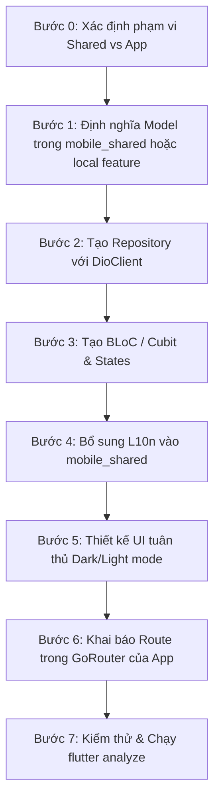

# Feature Development Guide (`Flutter Mobile Monorepo`)

Tài liệu này hướng dẫn quy trình tiêu chuẩn để thêm một tính năng hoặc màn hình mới trong hệ thống Flutter Monorepo CINEPLEX.

---

## 1. Xác định Phạm vi Feature (Scope Selection)

Trước khi viết code, AI Agent / Developer cần xác định:
- **Tính năng dùng chung hay thuộc một app cụ thể?**
  - Nếu là Model, Helper, Common Widget, hoặc API dùng chung -> Bổ sung vào `mobile/mobile_shared/`.
  - Nếu là chức năng Khách hàng (Đặt vé, xem phim, voucher) -> Viết vào `mobile/cineplex_client/`.
  - Nếu là chức năng Nhân viên (Soát vé phòng chiếu, POS bán vé tại quầy) -> Viết vào `mobile/cineplex_staff/`.
  - Nếu là chức năng Quản trị (Quản lý cụm rạp, phòng chiếu, phim, báo cáo) -> Viết vào `mobile/cineplex_admin/`.

---

## 2. Các bước triển khai một Feature mới

```mermaid
graph TD
    B0[Bước 0: Xác định phạm vi Shared vs App] --> B1[Bước 1: Định nghĩa Model trong mobile_shared hoặc local feature]
    B1 --> B2[Bước 2: Tạo Repository với DioClient]
    B2 --> B3[Bước 3: Tạo BLoC / Cubit & States]
    B3 --> B4[Bước 4: Bổ sung L10n vào mobile_shared]
    B4 --> B5[Bước 5: Thiết kế UI tuân thủ Dark/Light mode]
    B5 --> B6[Bước 6: Khai báo Route trong GoRouter của App]
    B6 --> B7[Bước 7: Kiểm thử & Chạy flutter analyze]
```

---

### Bước 1: Định nghĩa Model & DTO
- Đưa model chung vào `mobile_shared/lib/models/` và export qua `mobile_shared.dart`.
- Nếu chỉ dùng riêng tại 1 app, đặt trong `lib/features/<feature>/data/models/`.

### Bước 2: Tạo Repository
- Khởi tạo Repository nhận `DioClient` qua constructor (`final DioClient _dioClient;`).
- Gọi API endpoint tương ứng từ Backend.

### Bước 3: Tạo BLoC / Cubit & States
- Định nghĩa các trạng thái Initial, Loading, Success, Error kế thừa `Equatable`.
- Quản lý logic xử lý bất đồng bộ.

### Bước 4: Bổ sung Localization
- Thêm các key văn bản mới vào `mobile_shared/lib/l10n/app_en.arb` và `app_vi.arb`.
- Chạy `flutter gen-l10n` trong `mobile_shared`.

### Bước 5: Thiết kế UI Widgets & Screen
- Sử dụng các theme tokens từ `mobile_shared` (`AppColors`, `Theme.of(context)`).
- Hỗ trợ tốt cả Light Mode và Dark Mode.
- 100% text truy cập qua `AppLocalizations.of(context)!`.

### Bước 6: Khai báo Route trong GoRouter
- Thêm route vào router tương ứng (`app_router.dart`, `staff_router.dart`, hoặc `admin_router.dart`).
- Cấu hình route guard nếu yêu cầu đăng nhập / phân quyền.

### Bước 7: Kiểm thử & Phân tích chất lượng mã
- Chạy `flutter analyze --no-fatal-infos` đảm bảo không có cảnh báo hay lỗi.
- Chạy app bằng script tương ứng: `npm run mobile:client`, `npm run mobile:staff`, hoặc `npm run mobile:admin`.
